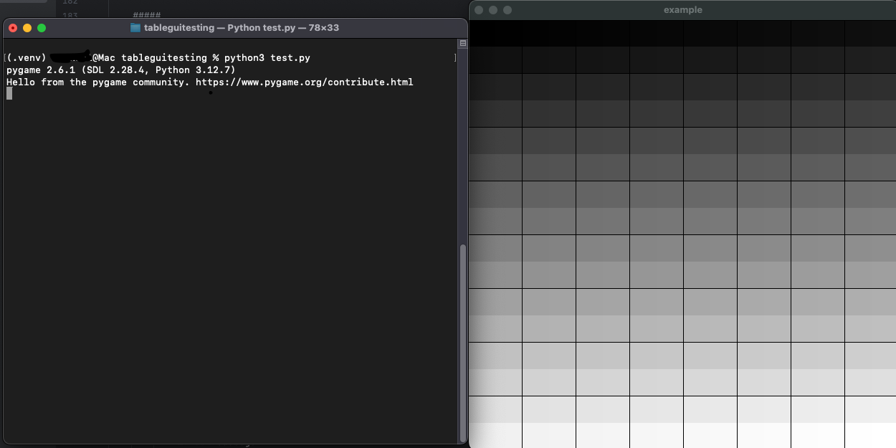

# TableGUI: A game engine using arrays (now rendering in a screen)
### (DO NOT DOWNLOAD ANY VERSION BELOW 1.1.0)
A pygame-dependent arrays in lists system to convert the data inside the lists
inside of an array to convert to pixels in a screen.



## Installation
The easiest way to install TableGUI is through PyPi (pip)
```
pip install TableGUI
```

## Usage
I don't know. Read the documentation (coming soon.)

## Version changelog
### 1.1.0: Fixes every issue.
### 1.1.1: Change some definitions of the table interpretation.